# Microscope automation stack

## Microscope control

See [`microscope_control/`](microscope_control/) for the Arduino + Python axis control module (focus / magnification / illumination).

## MAA

See [`maa/`](maa/) for Microscopy-Aware Attention and baseline architectures for classification, detection, and segmentation. Full comparison and ablation result tables are in [`maa/README.md`](maa/README.md#results).

Detailed hardware of the Levenhuk MED 30T automation is in [`microscope_control/README.md`](microscope_control/README.md).

## Hardware and Software Configuration

### Proposed Automated Microscope Manipulation Engine

The system is based on microscopes from the Levenhuk MED series, including the Levenhuk MED 20T, MED 25T, MED 30T, MED 35T, and MED 40T, which, despite their relative affordability, are equipped with infinity-corrected semi-plan achromatic optics (Infinity SemiPlan). An important characteristic of the proposed design is its modularity. Since the microscopes used in the study belong to the same Levenhuk MED family and share similar operating principles, the automation concept can be transferred between the MED 20T, MED 25T, MED 30T, MED 35T, and MED 40T configurations without changing the overall control architecture. It is important to note that the use of open-source electronics (Arduino UNO R3) and NEMA 17 stepper motors does not represent a compromise in controllability. Furthermore, open-source libraries (AccelStepper, GRBL) enable smooth acceleration and deceleration profiles, minimizing vibrations, and allow automatic calculation of the number of steps for precise positioning.

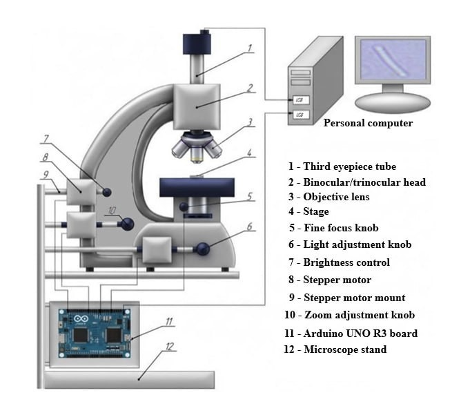

**Figure** Installation diagram of the control system.

An Arduino UNO R3 board based on the ATmega328 microcontroller was selected as the central controller of the automated microscope. The board communicates with the host computer via USB for both power supply and firmware upload. Arduino UNO R3 was chosen because it provides stable USB communication, supports convenient connector-based wiring without additional soldering, and can alternatively be powered through a 12 V DC jack. Its compact dimensions and mounting holes facilitate straightforward installation inside the microscope control enclosure.

The main characteristics of the Arduino UNO R3 board are presented in Table 1.

**Table 1.** Main characteristics of Arduino UNO R3.

| Parameter | Value |
| --- | --- |
| Operating voltage, V | 5 |
| Input voltage (limit), V | 6–20 |
| Digital I/O pins, pcs | 14 |
| Analog input pins, pcs | 6 |
| Maximum DC current per I/O pin, mA | 20 |
| Flash memory, KB | 32 |
| SRAM, KB | 2 |
| EEPROM, KB | 1 |
| Clock speed, MHz | 16 |
| Length, mm | 68.6 |
| Width, mm | 53.4 |

The automated microscope uses bipolar NEMA 17 stepper motors to control the mechanical adjustment mechanisms. Stepper motors provide motion through discrete angular steps, enabling repeatable positioning for focus and magnification adjustment.

The selected NEMA 17 stepper motors have a step angle of 1.8°, corresponding to 200 full steps per revolution. Each motor has a holding torque of 4 kgf·cm and a rated current of 1.7 A. These parameters were used for the subsequent selection and configuration of the stepper motor drivers.

The main characteristics of the NEMA 17 stepper motor are presented in Table 2.

**Table 2.** Main characteristics of NEMA 17.

| Parameter | Value |
| --- | --- |
| Flange size, mm | 42 |
| Number of phases | 2 |
| Step angle, ° | 1.8 |
| Current, A | 1.7 |
| Resistance per phase, Ohm | 1.5 |
| Inductance per phase, mH | 2.8 |
| Holding torque, kgf·cm | 4 |
| Shaft diameter, mm | 5 |
| Motor length, mm | 48 |

Dedicated stepper motor drivers are required to interface the Arduino controller with the bipolar stepper motors and to supply the current required by the motor windings. Since the selected NEMA 17 motor has a rated phase current of 1.7 A, the driver must be capable of continuously delivering at least this current. A supply voltage of 12 V was selected, which is sufficient for the required rotational speed of the microscope control mechanisms.

Several commercially available drivers were evaluated, including the A4988, DRV8825, TMC2208, and TMC2209. Although the A4988 and DRV8825 satisfy the basic control requirements, their lower continuous phase current makes additional cooling desirable under prolonged operation. The TMC2208 and TMC2209 drivers provide the required 1.7 A phase current together with integrated overtemperature protection and support microstepping up to 1/256.

Since the proposed system controls the focusing and objective adjustment mechanisms rather than high-speed positioning stages, microstepping modes of 1/8 or 1/16 provide sufficient positioning smoothness and accuracy. Based on these considerations, the TMC2209 driver was selected. A standard heatsink supplied with the driver is used to improve thermal stability during continuous operation.

The characteristics of the TMC2209 driver are presented in Table 3.

**Table 3.** Main characteristics of the TMC2209 driver.

| Parameter | Value |
| --- | --- |
| Supply voltage, V | 3.3 to 5 |
| Maximum current, A | 2.5 |
| Microstep configurations | 1/2, 1/4, 1/8, 1/16, 1/256 |
| Motor voltage, V | 5.5 to 28 |

A mechanical coupling was used to connect the stepper motor shaft to the corresponding microscope adjustment knob. The selected NEMA 17 stepper motor has a shaft diameter of 5 mm, while the microscope knob is mounted on a smaller metal shaft. A 5 mm × 4 mm coupling was therefore used to connect the two shafts and compensate for small axial misalignments.

The characteristics of the coupling are presented in Table 4.

**Table 4.** Main characteristics of the coupling.

| Parameter | Value |
| --- | --- |
| Length, mm | 25 |
| Outer diameter, mm | 20 |
| Inner diameter d1, mm | 4 |
| Inner diameter d2, mm | 5 |
| Maximum torque, N·m | 3 |

An adapter sleeve is used; its dimensions are determined by the size of the microscope knob shaft. The sleeve compensates for dimensional inaccuracies and eliminates gaps between the shaft and the coupling. It provides an absolutely rigid connection between the knob shaft and the coupling, eliminates runout, and minimizes vibrations. The inner diameter of the sleeve is determined by the size of the microscope knob shaft.

First, the sleeve is tightly pressed onto the microscope knob shaft. Then, the coupling is placed onto the motor shaft on one side and onto the sleeve on the other side. The coupling is tightened with set screws that fit into special machined recesses on the motor shaft and on the sleeve itself.

The Arduino UNO is powered from the host computer via a 5 V USB connection, whereas the stepper motor drivers and motors require an independent power supply. A supply voltage of 12 V was selected, which satisfies the operating requirements of the selected NEMA 17 stepper motors.

The required output current of the power supply was estimated as

<i>I</i> = <i>I</i>1 · <i>n</i>,

where <i>I</i>1 is the rated current of one stepper motor (A), and <i>n</i> is the number of stepper motors.

In the proposed system, three stepper motors with a rated current of 1.7 A are used:

<i>I</i> = 1.7 × 3 = 5.1 A.

To ensure reliable long-term operation, a safety margin was included when selecting the power supply. Consequently, a 12 V, 6 A switching power supply (LRS-75-12) was selected.

The LRS-75-12; its main characteristics are presented in Table 5.

**Table 5.** Main characteristics of the LRS–75–12 power supply.

| Parameter | Value |
| --- | --- |
| Output voltage, V | 12 |
| Output current, A | 6.25 |
| Output power, W | 75 |
| Input voltage, V | 85–264 |
| Input frequency, Hz | 47–63 |
| Efficiency, % | 87.5 |
| Dimensions (L × W × H), mm | 159 × 97 × 38 |

A mounting board with screw terminal blocks is necessary for safely distributing 12 V power from a single power supply to three drivers, for maintainability, and for protecting the Arduino from current overloads. In our case, the MV–102 mounting board is the most suitable. Its characteristics are presented in Table 6.

**Table 6.** Main characteristics of the MV–102 mounting board.

| Parameter | Value |
| --- | --- |
| Dimensions (L × W), mm | 163 × 54 |
| Number of tie points, pcs | 830 |
| Maximum contact resistance, mOhm | 100 |
| Insulation resistance, mOhm | 1000 |

Terminal blocks were used to provide reliable electrical connections between the power supply, motor drivers, and stepper motors. Since the proposed system contains three stepper motors, the required number of electrical connections was calculated prior to component selection. The total number of required contacts is 22, including:

1. Power supply (12 V, GND): 4 contacts;
2. Stepper motors (3 × 4 wires): 12 contacts;
3. Driver control signals (STEP, DIR): 6 contacts.

Three KF128-4P terminal blocks were used to connect the stepper motors through the A+, A-, B+, and B- terminals. An additional KF128-4P terminal block was used for distributing the 12 V power supply (12 V, GND, 12 V, GND). The STEP and DIR control signals were connected using three KF128-3P terminal blocks.

The selected configuration provides a total of 25 terminals, exceeding the required 22 terminals and leaving three spare terminals that can be used for future expansion or auxiliary connections.

The selected KF128 terminal blocks satisfy the electrical and mechanical requirements of the proposed system. Their main specifications are summarized in Table 7.

**Table 7.** Main characteristics of the KF128 terminal blocks.

| Parameter | Value |
| --- | --- |
| Pitch, mm | 2.54 |
| Rated voltage, V | 125 |
| Rated current, A | 6 |

The control electronics were installed inside a plastic enclosure to protect the system from dust, accidental contact, and mechanical damage. Inside the enclosure, a mounting plate accommodates the Arduino UNO R3 controller, three TMC2209 stepper motor drivers, and the terminal blocks used for power and motor connections. The electronic components are secured using M3 screws, while cable ties are used for wire management. Since the enclosure is manufactured from insulating plastic, protective grounding of the enclosure is not required.

The electrical system consists of separate control, power, and signal circuits. The 5 V control circuit is formed by the Arduino UNO board, which is powered via a USB connection from the host computer. The 12 V power circuit is supplied by the LRS-75-12 switching power supply, which provides power to the VMOT and GND terminals of each TMC2209 driver.

Control signals are transmitted through the STEP and DIR outputs of the Arduino, which are connected to the corresponding inputs of each motor driver. A common ground connection is established between the Arduino and all motor drivers to ensure reliable operation. Each NEMA 17 stepper motor is connected to its corresponding driver through four motor leads connected to the A1, A2, B1, and B2 driver outputs.

A CORNER PROFI T3815 stand was selected to provide rigid fixation of the stepper motors and accurate shaft alignment. Its main specifications are summarized in Table 8.

**Table 8.** Main characteristics of the stand.

| Parameter | Value |
| --- | --- |
| Height, m | 1.2–3.8 |
| Load capacity, kg | >15 |
| Material | Metal |

### Driver Current Adjustment

According to the technical documentation of the TMC2209 stepper motor driver, the reference voltage <i>V</i>ref is determined from the RMS motor current. Since the driver includes built-in R110 sense resistors, the sense resistance is

<i>R</i>sense = 0.11 Ω.

The RMS current is related to the reference voltage by

<i>I</i>rms = <i>V</i>ref / (2 <i>R</i>sense √2),

where

- <i>I</i>rms is the RMS motor current (A);
- <i>R</i>sense is the sense resistor value (Ω);
- <i>V</i>ref is the driver reference voltage (V).

Rearranging,

<i>V</i>ref = <i>I</i>rms · 2 <i>R</i>sense √2.

For the selected stepper motors,

<i>V</i>ref = 1.7 · 2 · 0.11 · √2 = 0.529 V.

Therefore, the calculated reference voltage is approximately

<i>V</i>ref = 0.53 V.

In practice, the driver was adjusted to approximately 0.60 V to provide a small operating margin.

The reference voltage was adjusted before connecting the motor supply voltage (VMOT). During adjustment, only the 5 V logic supply was connected to the driver.

A digital multimeter operating in DC voltage mode was connected between the driver ground and the adjustment potentiometer. The potentiometer was initially rotated fully counterclockwise and then slowly adjusted clockwise until the measured reference voltage reached approximately 0.60 V.

### Mechanical Calibration

Following electrical adjustment, the mechanical transmission was inspected to verify correct alignment of all couplings and smooth movement of the focusing mechanism. The motors were tested over the full operating range to ensure that no excessive friction, shaft misalignment, or mechanical binding occurred during operation.

### Host Computer Communication

The automation module was used to control the main acquisition parameters, including focusing, magnification adjustment, and illumination control.

The Arduino board was connected to the host computer via USB, which was used both for power supply during testing and for serial communication with the acquisition software.

### Image Acquisition Workflow

The image acquisition workflow was controlled from the host computer. For each microscopic scene, the acquisition software initialized the microscope control module, moved the focus mechanism to the required position, adjusted illumination parameters, and captured the corresponding image. This procedure reduced operator-dependent variability and ensured that the same acquisition protocol was applied across all samples.

### Deep Learning Workstation and Software Environment

All experiments were carried out using a combined microscopy acquisition and deep learning computation pipeline. The experimental setup consisted of two main components: an automated optical microscopy subsystem used for standardized image acquisition and a dedicated deep learning workstation used for model training, inference, ablation analysis, and metric computation.

The acquired images were stored together with metadata describing acquisition settings, class labels, bounding-box annotations, and segmentation masks where available. These metadata files were later used to construct fixed training, validation, and test subsets for classification, detection, and segmentation experiments.

Neural network experiments were performed on a local deep learning workstation equipped with two NVIDIA GeForce RTX 4090 GPUs, each with 24 GB of GDDR6X memory. The workstation also included an Intel Xeon w7-2495X CPU, 128 GB of DDR5 ECC RAM, and 4 TB of NVMe SSD storage. This configuration was selected to support repeated training of modern convolutional, transformer-based, and hybrid computer vision architectures under identical experimental conditions. The two GPUs were used for model training and inference, including forward propagation, backpropagation, gradient computation, and mixed-precision operations. The CPU was primarily used for data loading, image preprocessing, augmentation, batch preparation, annotation parsing, and metric aggregation. The 128 GB of system memory allowed image metadata, annotation tables, split files, data loader buffers, and intermediate evaluation results to be processed without excessive disk swapping. NVMe SSD storage reduced input-output bottlenecks when reading microscopy images and writing model checkpoints, logs, and prediction outputs.

The software environment was based on Ubuntu 22.04 LTS, Python 3.11, PyTorch 2.7.0, torchvision 0.22.0, CUDA 12.6, and cuDNN 9. Model training and inference were implemented in PyTorch. Multi-GPU training was performed using PyTorch Distributed Data Parallel when the model architecture and batch-size budget allowed it. Mixed-precision training with FP16 was enabled through Automatic Mixed Precision to reduce GPU memory consumption and accelerate optimization. For models with high memory requirements, gradient accumulation was used to maintain comparable effective batch sizes across architectures.

Additional data processing and evaluation routines were implemented using OpenCV, NumPy, pandas, scikit-learn, and pycocotools. OpenCV was used for image reading, resizing, contrast normalization, and basic preprocessing operations. NumPy and pandas were used for numerical operations, annotation tables, split files, experiment logs, and aggregation of repeated runs. The scikit-learn library was used to compute classification metrics, including Precision, Recall, and F1-score. Detection metrics, including mean Average Precision and Intersection over Union, were computed using COCO-style evaluation routines. Segmentation metrics, including mean Dice coefficient and mean Intersection over Union, were computed from predicted and ground-truth masks after applying the same post-processing protocol to all models.

All computational experiments were conducted under a fixed and reproducible protocol. The train, validation, and test splits were fixed once and reused for all baseline models, MAA attention variants, no-attention configurations, and leave-one-out ablation experiments. Randomness was controlled by fixing seeds for Python, NumPy, PyTorch, and CUDA. The main experimental seeds were 42, 123, and 321, and the reported results correspond to the mean values over repeated runs unless stated otherwise. CuDNN deterministic mode was enabled whenever supported by the corresponding operations. This setup ensured that differences between methods were caused primarily by model architecture and attention configuration rather than by uncontrolled data splits or initialization effects.

## Dataset

Download: [Zenodo record 21738370](https://zenodo.org/records/21738370) ([DOI: 10.5281/zenodo.21738370](https://doi.org/10.5281/zenodo.21738370)).

The dataset produced with this hardware and software configuration is publicly available on Zenodo: [https://zenodo.org/records/21738370](https://zenodo.org/records/21738370).

This dataset contains 100,000 annotated microscopy images evenly distributed across five classes — background, micrococci, diplococci, streptococci, and bacilli — with 20,000 images per class. All images are accompanied by pixel-level segmentation masks and corresponding bounding-box annotations, providing complete supervision for classification, object detection, and segmentation. No corrupted images, missing annotations, or empty segmentation masks were detected during verification.

### Dataset structure

The dataset is organized into two folders:

- `images/` — microscopy images in PNG format
- `masks/` — corresponding binary segmentation masks in PNG format

Each image and its mask share the same filename.

On the masks, white pixels with a value of `255` correspond to foreground regions, whereas black pixels with a value of `0` represent the background.

The dataset is specifically constructed to reflect the variability encountered in real-world diagnostic laboratories. During data acquisition, several microscopes from the same Levenhuk MED series were used interchangeably within the experimental setup, including the Levenhuk MED 20T, MED 25T, MED 30T, MED 35T, and MED 40T. Thus, the acquisition system was not restricted to a single microscope: microscopes could be replaced within the setup while maintaining the same general acquisition and automation workflow. In addition to microscope variability, the dataset includes variations in magnification settings, illumination configurations, staining procedures, spatial resolution, object scale, brightness, contrast, sharpness, and color distribution. This heterogeneity ensures that models trained on this dataset are exposed to a broad range of microscopy acquisition conditions.

### Microorganism classes

The selected microorganism categories reflect both the morphological diversity of microscopic objects and the major challenges arising in automatic microscopy image analysis. Each class represents a distinct type of difficulty for computer vision systems, including small object recognition, structural variability, object aggregation, and degradation caused by imaging conditions.

| (a) Micrococci | (b) Diplococci |
|:---:|:---:|
| 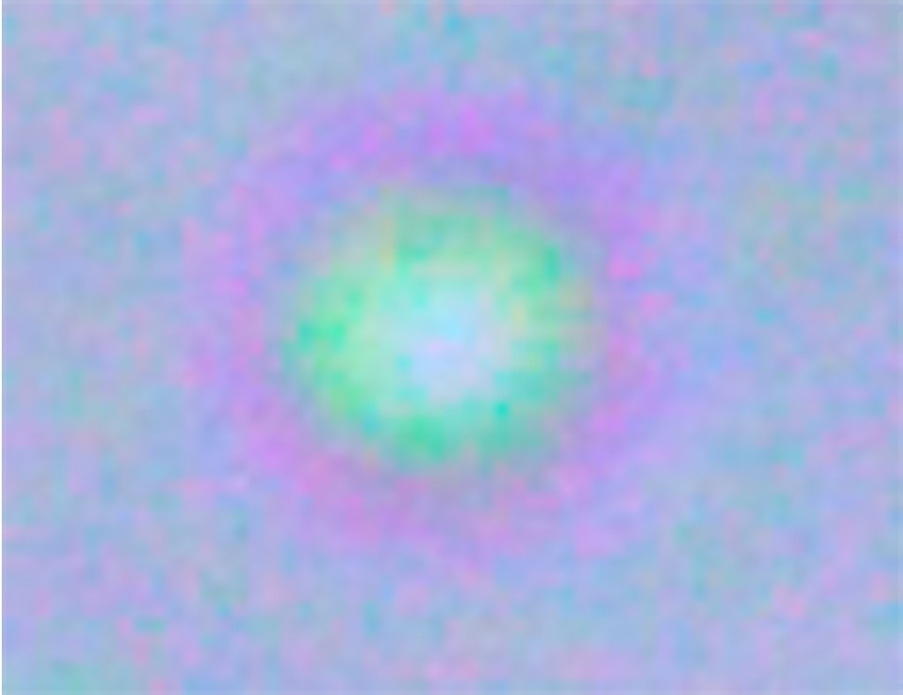 | 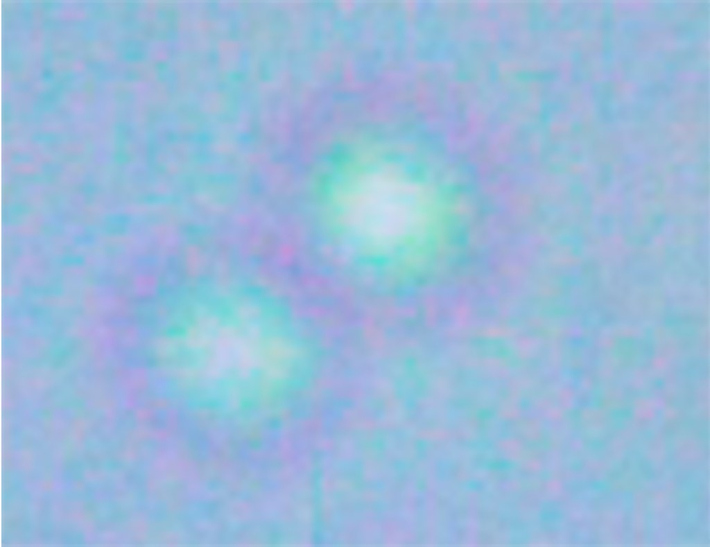 |
| (c) Streptococci | (d) Bacilli |
| 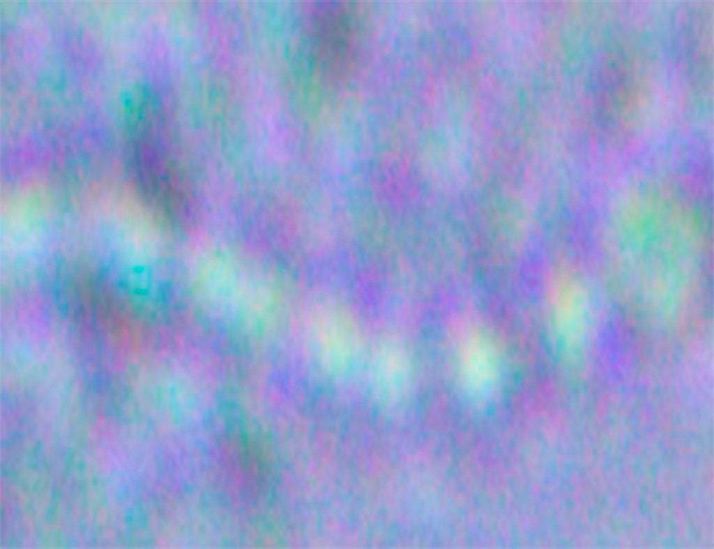 | 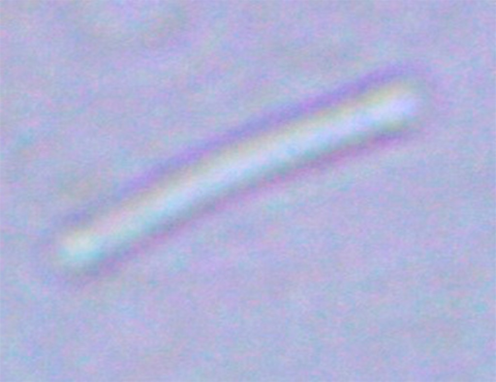 |

*Representative examples of the considered microorganism classes under a microscope. (a) Micrococci: isolated spherical cells. (b) Diplococci: paired spherical cells (paired arrangement). (c) Streptococci: chain-like arrangements of cells. (d) Bacilli: elongated rod-shaped cells.*

**Micrococci** are isolated spherical microorganisms that typically occupy only a small portion of the image. Due to their limited size and relatively simple morphology, micrococci provide little visual information and may become difficult to distinguish under noisy or low-contrast imaging conditions. This class is therefore particularly relevant for evaluating recognition performance when only a small number of discriminative features are available.

**Diplococci** consist of paired spherical microorganisms whose identification depends on preserving local spatial relationships between adjacent cells. Variations in focus quality, image resolution, and staining intensity may significantly affect the visibility of these relationships, increasing the difficulty of reliable classification. Consequently, this class provides a useful benchmark for evaluating sensitivity to fine structural details.

**Streptococci** are characterized by chain-like arrangements of cells with highly variable length, orientation, and density. Such variability introduces substantial intra-class diversity and requires models to capture structural patterns at multiple spatial scales. Furthermore, individual chains may partially overlap or become fragmented due to acquisition artifacts, which further complicates recognition.

**Bacilli.** The bacilli class contains elongated rod-shaped microorganisms exhibiting considerable variation in size, orientation, and aggregation patterns. In many cases, bacilli appear partially visible, overlap with neighboring structures, or are located near artifacts introduced during specimen preparation. As a result, this category represents a challenging scenario for both classification and segmentation tasks.

**Background** covers regions without target microorganisms (other tissue, debris, or empty fields) and serves as the negative class for classification and as context for detection and segmentation.

Image resolutions range approximately from 40 × 40 to 759 × 661 pixels. Across classes, mean grayscale brightness is about 173–178, contrast 8.3–10.8, dynamic range 55–91, entropy 4.4–5.0 bits, Laplacian variance (sharpness) 35–89, and colorfulness 27.1–31.1. The average foreground fraction ranges from about 26% for bacilli to 45% for diplococci and streptococci. Bounding boxes are generally centered (normalized centers ~0.50) with aspect ratios spanning approximately 0.14–7.26. Segmentation masks form single connected components with no missing regions.

The main characteristics of the dataset are summarized in Table 9.

**Table 9.** Main characteristics of the dataset.

| Parameter | Value |
| --- | --- |
| Number of image/mask pairs | 100,000 |
| Images per class | 20,000 |
| Number of classes | 5 |
| Image resolution range | approximately 40 × 40 to 759 × 661 pixels |
| Mean grayscale brightness | approximately 173–178 |
| Mean grayscale contrast | approximately 8.3–10.8 |
| Mean dynamic range | approximately 55–91 |
| Mean image entropy | approximately 4.4–5.0 bits |
| Laplacian variance | approximately 35–89 |
| Mean colorfulness | approximately 27.1–31.1 |
| Foreground fraction | approximately 26–45% |
| Bounding-box aspect ratio range | approximately 0.14–7.26 |
| Microscopes used | Levenhuk MED 20T, MED 25T, MED 30T, MED 35T, MED 40T |
| Image format | JPG, PNG |
| Mask format | PNG |

## Results

Best models with Microscopy-Aware Attention (MAA) vs the same backbone without extra attention (mean over seeds 42 / 123 / 321):

| Task | Best backbone | Metric | None | MAA | ∆ |
|------|---------------|--------|-----:|----:|--:|
| Classification | DINOv3 | Weighted F1 | 0.947 | 0.975 | +0.028 |
| Detection | InternImage-H | mAP@0.5 | 0.901 | 0.928 | +0.027 |
| Segmentation | SegMAN | mIoU | 0.834 | 0.862 | +0.028 |

Complete backbone × attention grids and leave-one-out prior ablations: [`maa/README.md`](maa/README.md#results).

### Detection examples

Representative object detection results localize microorganisms and assign the corresponding class labels. Red bounding boxes indicate the detected microorganisms and their predicted class labels.

| (a) Micrococci | (b) Diplococci |
|:---:|:---:|
| 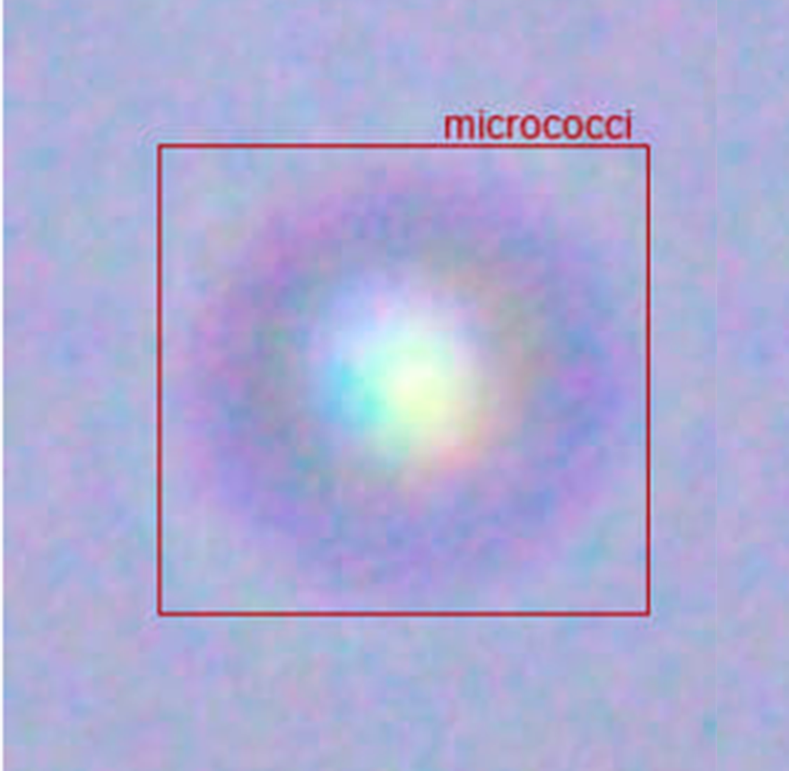 | 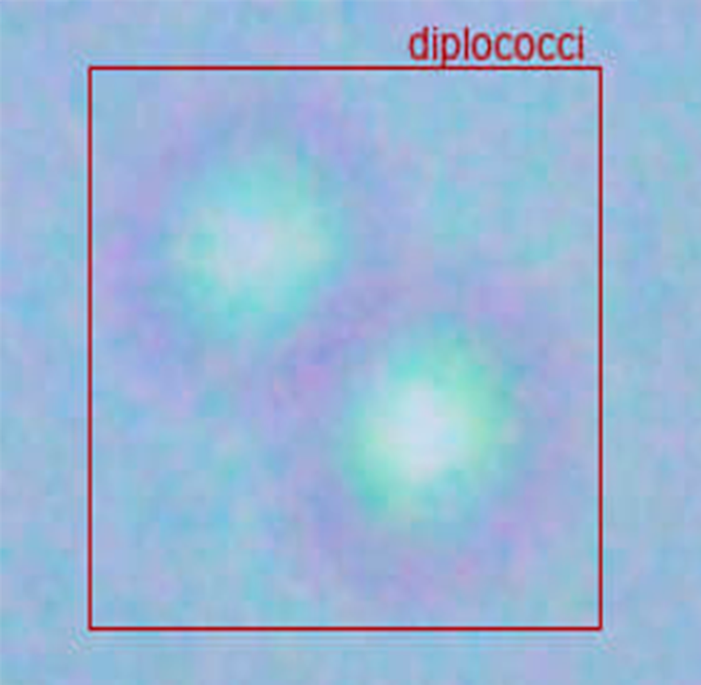 |
| (c) Bacilli | (d) Streptococci |
| 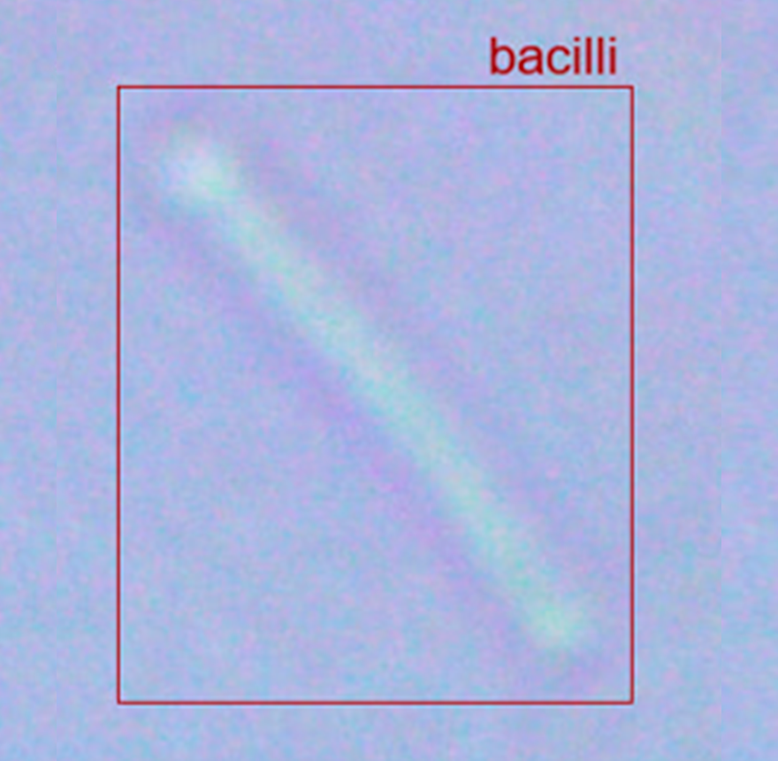 | 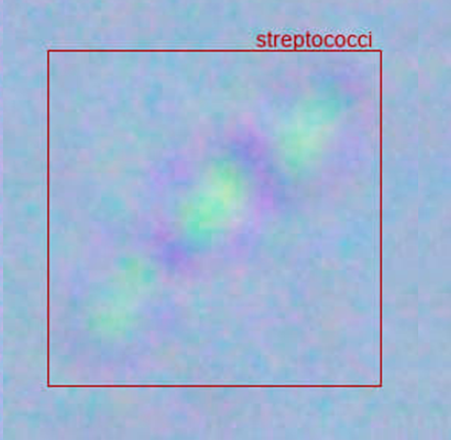 |

*Representative examples of microorganism detection results. (a) Micrococci. (b) Diplococci. (c) Bacilli. (d) Streptococci. Red bounding boxes indicate the detected microorganisms and their predicted class labels.*

### Segmentation examples

Representative instance segmentation results are shown below. The predicted segmentation masks accurately delineate microorganism boundaries while preserving the characteristic morphology of each class.

| (a) Diplococci | (b) Streptococci |
|:---:|:---:|
| 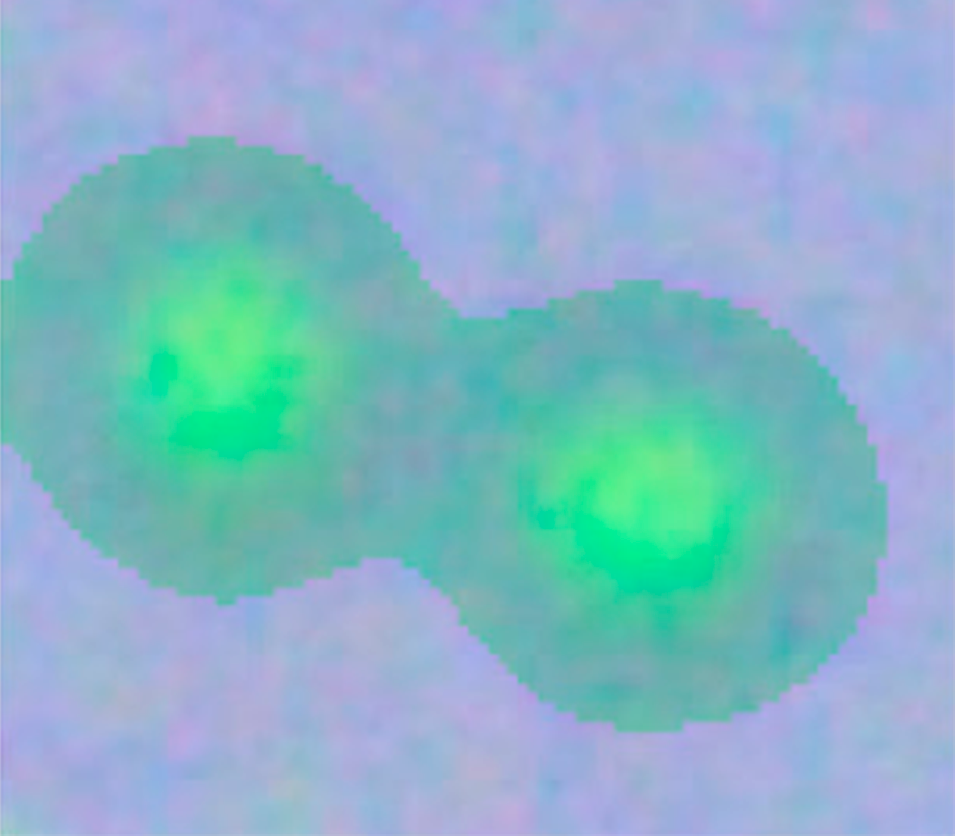 | 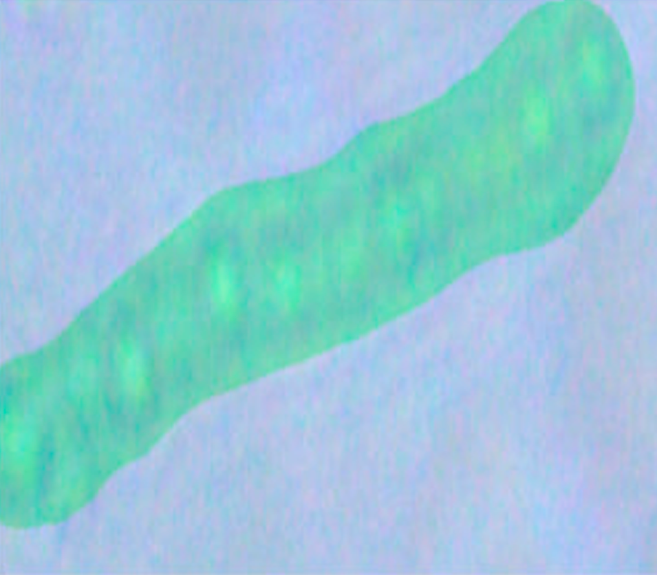 |
| (c) Micrococci | (d) Bacilli |
| 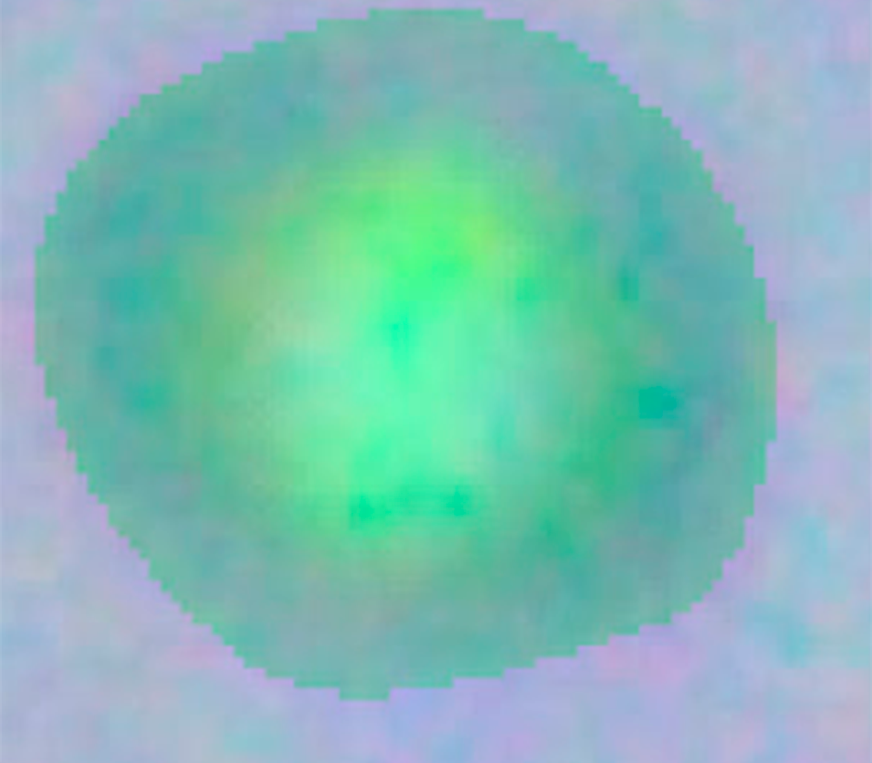 | 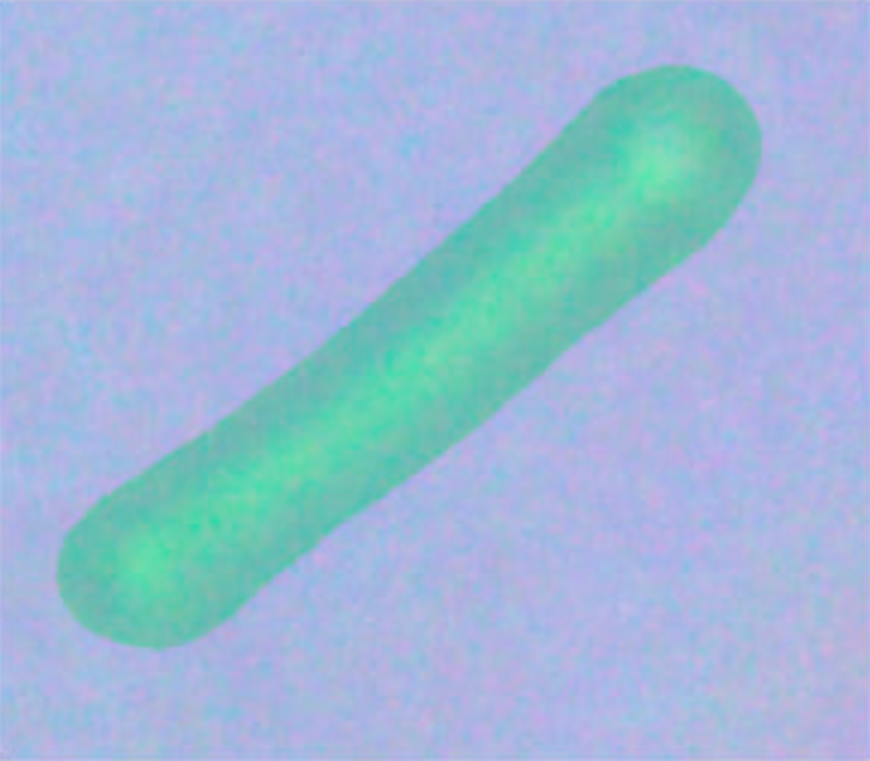 |

*Representative examples of microorganism instance segmentation results. (a) Diplococci. (b) Streptococci. (c) Micrococci. (d) Bacilli. The predicted segmentation masks accurately delineate microorganism boundaries while preserving the characteristic morphology of each class.*

