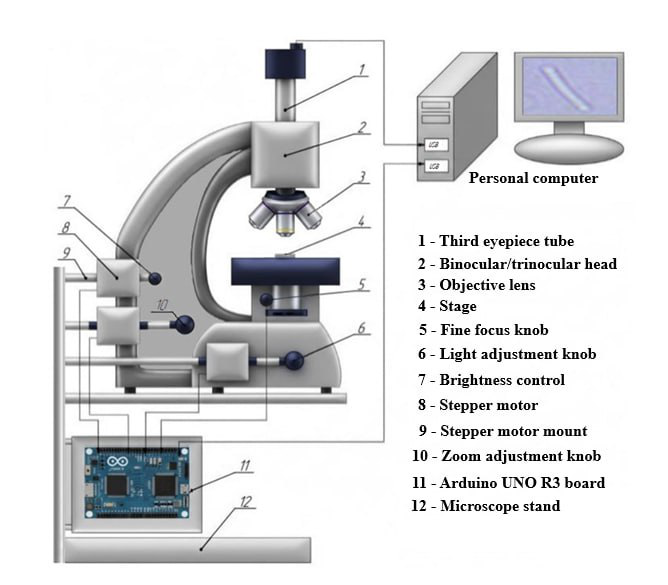

# Microscope Control

Control module for an automated microscope (Levenhuk MED 30T): Arduino UNO R3 and three NEMA 17 + TMC2209 axes (focus / magnification / illumination).

## Layout

| Path | Purpose |
|------|---------|
| `firmware/microscope_controller/` | Arduino firmware (AccelStepper, protocol v1.1) |
| `src/microscope_control/` | Python host: protocol, safety, calibration, presets, CLI |
| `config/default.yaml` | Full installation config (pins, MS, profiles, presets, safety) |
| `config/profiles/` | Motion profile overrides |
| `config/hardware/` | Driver / wiring notes |
| `config/serial_*.example.yaml` | Example serial connection configs |

## Install

```bash
cd microscope_control
pip install -e ".[dev]"
```

## Connecting to Arduino

1. Install [AccelStepper](https://www.arduino.cc/reference/en/libraries/accelstepper/) in the Arduino IDE.
2. Flash `firmware/microscope_controller/microscope_controller.ino`.
3. Set TMC2209 Vref ≈ **0.60 V** (Rsense 0.11 Ω, Irms ≈ 1.7 A); motor PSU **12 V** separate from USB.
4. Confirm MS1/MS2/MS3 for 1/16 (firmware drives pins 9/10/11 HIGH by default).
5. Use an example config or set:

```yaml
connection: serial
serial:
  port: COM3          # or /dev/ttyACM0
  baudrate: 115200
```

```bash
python -m microscope_control --config config/serial_windows.example.yaml status
```

## Protocol (115200 8N1, v1.1)

Replies: `ok` / `error:<msg>` / `status:...` / `version:...` / `limits:...` / `diag:...`

| Command | Meaning |
|---------|---------|
| `PING` | Liveness |
| `VERSION` | Firmware id + protocol |
| `ENABLE` / `DISABLE` / `STOP` | Driver power / halt |
| `STATUS` / `LIMITS` / `DIAG` | Telemetry |
| `MOVE F\|M\|I <steps>` | Relative move |
| `GOTO F\|M\|I <pos>` | Absolute move |
| `HOME F\|M\|I` | Go to home counter |
| `SETPOS F\|M\|I <pos>` | Redefine step counter |
| `SETSPEED` / `SETACC` | Motion dynamics |
| `SETPROFILE <name>` | Record active profile name |
| `SYNC F=<n> M=<n> I=<n>` | Multi-axis absolute move |

## Configuration highlights

- **Pins + microstep MS levels** for TMC2209
- **Motion profiles**: coarse / fine / acquisition / homing / ultra_fine
- **Presets**: return to predefined F/M/I geometries
- **Calibration**: focus µm, named objectives, illumination 0–100
- **Safety**: soft limits, relative move caps, speed/accel clamps
- **Diagnostics**: self-test + open-loop repeatability sweep

## Automated microscope hardware

The system is based on the Levenhuk MED 30T microscope, which, despite its relative affordability, is equipped with infinity-corrected semi-plan achromatic optics (Infinity SemiPlan). Such optics, traditionally used in professional instruments, provide a high degree of image flatness and allow additional components to be placed in the optical path without loss of quality. This optical foundation is precisely the basis upon which the automation system achieves image quality comparable to that of expensive industrial solutions. It is important to note that the use of open-source electronics (Arduino UNO R3) and NEMA 17 stepper motors does not represent a compromise in controllability. On the contrary, modern stepper motor drivers such as the A4988 or the quieter TMC2208 support microstepping (up to 1/16 and higher), which makes it possible to achieve focus movement resolution on the order of 0.1–0.2 µm with a mechanical leadscrew pitch of 1 mm and 1/16 microstepping. This is comparable to the specifications of entry-level industrial motorized microscopes. With Arduino and NEMA 17 motors driving the focus of a Levenhuk MED 30T microscope, the error in returning to the same focal plane after a series of movements was less than 0.5 µm, which is sufficient for most brightfield and phase-contrast microscopy tasks. Furthermore, open-source libraries (AccelStepper, GRBL) enable smooth acceleration and deceleration profiles, minimizing vibrations, and allow automatic calculation of the number of steps for precise positioning. Thus, the system combines low cost (approximately 5–10% of the price of a ready-made motorized microscope of a similar class) with controllability and accuracy sufficient to obtain standardized image datasets suitable for training machine learning models.

An important characteristic of the proposed design is its modularity. Since the microscopes used in the study belong to the same Levenhuk MED family and share similar operating principles, the automation concept can be transferred between the MED 20T, MED 25T, MED 30T, MED 35T, and MED 40T configurations without changing the overall control architecture.



*Installation diagram of the control system.* Three NEMA 17 steppers on a shared mount actuate fine focus, zoom/magnification, and illumination knobs; the Arduino UNO R3 and the camera on the third eyepiece tube connect to the host PC over USB.

| # | Component |
|---|-----------|
| 1 | Third eyepiece tube |
| 2 | Binocular/trinocular head |
| 3 | Objective lens |
| 4 | Stage |
| 5 | Fine focus knob |
| 6 | Light adjustment knob |
| 7 | Brightness control |
| 8 | Stepper motor |
| 9 | Stepper motor mount |
| 10 | Zoom adjustment knob |
| 11 | Arduino UNO R3 board |
| 12 | Microscope stand |

An Arduino UNO R3 microcontroller board was selected as the central controller of the automated microscope.

### Arduino UNO R3 characteristics

| Parameter | Value |
|-----------|-------|
| Operating voltage, V | 5 |
| Input voltage (limit), V | 6–20 |
| Digital I/O pins, pcs | 14 |
| Analog input pins, pcs | 6 |
| Maximum DC current per I/O pin, mA | 20 |
| Flash memory, KB | 32 |
| SRAM, KB | 2 |
| EEPROM, KB | 1 |
| Clock speed, MHz | 16 |
| Length, mm | 68.6 |
| Width, mm | 53.4 |

The actuators in our project will be bipolar stepper motors. Stepper motors move by a strictly defined angle, which is quite important for adjusting focus or image zoom. In our project, the NEMA 17 stepper motor can be used.

In our case, a stepper motor with a step angle of 1.8° can be used, so a full revolution of the motor shaft will be 200 steps. The holding torque is preferably selected up to 4 kgf·cm. The current value will influence the choice of driver for our stepper motor; in our case, a current of 1.7 A is appropriate. According to these criteria, the NEMA 17 stepper motor is suitable for us.

The main characteristics of the NEMA 17 stepper motor are as follows.

### NEMA 17 characteristics

| Parameter | Value |
|-----------|-------|
| Flange size, mm | 42 |
| Number of phases | 2 |
| Step angle, ° | 1.8 |
| Current, A | 1.7 |
| Resistance per phase, Ohm | 1.5 |
| Inductance per phase, mH | 2.8 |
| Holding torque, kgf·cm | 4 |
| Shaft diameter, mm | 5 |
| Motor length, mm | 48 |

To drive the selected stepper motors, dedicated motor drivers are required. Several commercially available drivers, including the A4988, DRV8825, TMC2208, and TMC2209, were evaluated. The TMC2209 driver was selected because it provides the required continuous phase current (1.7 A), integrated thermal protection, and smooth microstepping operation suitable for precise microscope control. Although the driver supports microstepping up to 1/256, a setting of 1/8 or 1/16 was sufficient for the system.

The characteristics of the TMC2209 driver are as follows.

### TMC2209 characteristics

| Parameter | Value |
|-----------|-------|
| Supply voltage, V | 3.3 to 5 |
| Maximum current, A | 2.5 |
| Microstep configurations | 1/2, 1/4, 1/8, 1/16, 1/256 |
| Motor voltage, V | 5.5 to 28 |

It is necessary to implement a mechanical connection between the stepper motor shaft and the adjustment knob on the microscope. First, we need to examine and determine the dimensions. The shaft diameter of the NEMA 17 stepper motor selected earlier is 5 mm. The diameter of the microscope knob is 40 mm, but the diameter of the metal shaft onto which it is mounted is smaller. To connect the knob shaft and the stepper motor shaft, we can use a coupling with dimensions of 5 mm × 4 mm. It will compensate for small misalignments of the axes.

The characteristics of the coupling are as follows.

### Coupling characteristics

| Parameter | Value |
|-----------|-------|
| Length, mm | 25 |
| Outer diameter, mm | 20 |
| Inner diameter d1, mm | 4 |
| Inner diameter d2, mm | 5 |
| Maximum torque, N·m | 3 |

We will also need an adapter sleeve; its dimensions are determined by the size of the microscope knob shaft. The sleeve compensates for dimensional inaccuracies and eliminates gaps between the shaft and the coupling. It provides an absolutely rigid connection between the knob shaft and the coupling, eliminates runout, and minimizes vibrations. The inner diameter of the sleeve is determined by the size of the microscope knob shaft.

First, the sleeve is tightly pressed onto the microscope knob shaft. Then, the coupling is placed onto the motor shaft on one side and onto the sleeve on the other side. The coupling is tightened with set screws that fit into special machined recesses on the motor shaft and on the sleeve itself.

A key point for the operation of our mechanisms is power supply. The Arduino UNO is powered via USB (5V) from a PC, but the drivers and the stepper motor require a separate power source. A 12 V, 6 A power supply was selected according to the total current consumption of the three stepper motors. The LRS–75–12.

### LRS–75–12 power supply

| Parameter | Value |
|-----------|-------|
| Output voltage, V | 12 |
| Output current, A | 6.25 |
| Output power, W | 75 |
| Input voltage, V | 85–264 |
| Input frequency, Hz | 47–63 |
| Efficiency, % | 87.5 |
| Dimensions (L×W×H), mm | 159×97×38 |

A mounting board with screw terminal blocks is necessary for safely distributing 12V power from a single power supply to three drivers, for maintainability, and for protecting the Arduino from current overloads. In our case, the MV–102 mounting board is the most suitable.

### MV–102 mounting board

| Parameter | Value |
|-----------|-------|
| Dimensions (L×W), mm | 163×54 |
| Number of tie points, pcs | 830 |
| Maximum contact resistance, mOhm | 100 |
| Insulation resistance, mOhm | 1000 |

Terminal blocks were used to provide reliable electrical connections between the power supply, motor drivers, and stepper motors. The selected KF128 terminal blocks satisfy the electrical and mechanical requirements of the system.

The control electronics were installed inside a plastic enclosure to protect the system from dust, accidental contact, and mechanical damage. The enclosure accommodates the Arduino UNO R3 controller, TMC2209 motor drivers, and the associated electrical connections.

A CORNER PROFI T3815 stand was selected to provide rigid fixation of the stepper motors and accurate shaft alignment.

### Stand characteristics

| Parameter | Value |
|-----------|-------|
| Height, m | 1.2–3.8 |
| Load capacity, kg | >15 |
| Material | Metal |

The electrical system comprises separate control (5 V), power (12 V), and signal circuits. The Arduino UNO communicates with the TMC2209 drivers through STEP and DIR control signals, while the LRS-75-12 power supply provides the required power for the motor drivers and stepper motors.

Before operation, the stepper motor drivers were electrically configured by adjusting the reference voltage (Vref) according to the motor current rating, followed by mechanical calibration of the drive system to verify proper coupling alignment and smooth motion of all motorized axes.

## Hardware Implementation Details

Detailed engineering calculations and implementation procedures for the hardware configuration.

### Arduino UNO R3 Controller

An Arduino UNO R3 board based on the ATmega328 microcontroller was selected as the central controller of the automated microscope. The board communicates with the host computer via USB for both power supply and firmware upload. Arduino UNO R3 was chosen because it provides stable USB communication, supports convenient connector-based wiring without additional soldering, and can alternatively be powered through a 12 V DC jack. Its compact dimensions and mounting holes facilitate straightforward installation inside the microscope control enclosure.

### Power Supply Selection

The Arduino UNO is powered from the host computer via a 5 V USB connection, whereas the stepper motor drivers and motors require an independent power supply. A supply voltage of 12 V was selected, which satisfies the operating requirements of the selected NEMA 17 stepper motors.

The required output current of the power supply was estimated as

```
I = I1 · n
```

where I1 is the rated current of one stepper motor (A), and n is the number of stepper motors.

In the system, three stepper motors with a rated current of 1.7 A are used:

```
I = 1.7 × 3 = 5.1 A
```

To ensure reliable long-term operation, a safety margin was included when selecting the power supply. Consequently, a 12 V, 6 A switching power supply (LRS-75-12) was selected.

### Stepper Motor Driver Selection

Dedicated stepper motor drivers are required to interface the Arduino controller with the bipolar stepper motors and to supply the current required by the motor windings. Since the selected NEMA 17 motor has a rated phase current of 1.7 A, the driver must be capable of continuously delivering at least this current. A supply voltage of 12 V was selected, which is sufficient for the required rotational speed of the microscope control mechanisms.

Several commercially available drivers were evaluated, including the A4988, DRV8825, TMC2208, and TMC2209. Although the A4988 and DRV8825 satisfy the basic control requirements, their lower continuous phase current makes additional cooling desirable under prolonged operation. The TMC2208 and TMC2209 drivers provide the required 1.7 A phase current together with integrated overtemperature protection and support microstepping up to 1/256.

Since the system controls the focusing and objective adjustment mechanisms rather than high-speed positioning stages, microstepping modes of 1/8 or 1/16 provide sufficient positioning smoothness and accuracy. Based on these considerations, the TMC2209 driver was selected. A standard heatsink supplied with the driver is used to improve thermal stability during continuous operation.

### Terminal Block Selection

Terminal blocks were selected to provide reliable electrical connections between the power supply, motor drivers, and stepper motors. Since the system contains three stepper motors, the required number of electrical connections was calculated prior to component selection.

The total number of required contacts is 22, including:

1. Power supply (12 V, GND): 4 contacts;
2. Stepper motors (3×4 wires): 12 contacts;
3. Driver control signals (STEP, DIR): 6 contacts.

Three KF128-4P terminal blocks were used to connect the stepper motors through the A+, A−, B+, and B− terminals. An additional KF128-4P terminal block was used for distributing the 12 V power supply (12 V, GND, 12 V, GND). The STEP and DIR control signals were connected using three KF128-3P terminal blocks.

The selected configuration provides a total of 25 terminals, exceeding the required 22 terminals and leaving three spare terminals that can be used for future expansion or auxiliary connections.

The main characteristics of the selected terminal blocks are as follows.

### KF128 terminal blocks

| Parameter | Value |
|-----------|-------|
| Pitch, mm | 2.54 |
| Rated voltage, V | 125 |
| Rated current, A | 6 |

### Hardware Assembly and Wiring

The control electronics were installed inside a plastic enclosure to protect the system from dust, accidental contact, and mechanical damage. Inside the enclosure, a mounting plate accommodates the Arduino UNO R3 controller, three TMC2209 stepper motor drivers, and the terminal blocks used for power and motor connections. The electronic components are secured using M3 screws, while cable ties are used for wire management. Since the enclosure is manufactured from insulating plastic, protective grounding of the enclosure is not required.

The electrical system consists of separate control, power, and signal circuits. The 5 V control circuit is formed by the Arduino UNO board, which is powered via a USB connection from the host computer. The 12 V power circuit is supplied by the LRS-75-12 switching power supply, which provides power to the VMOT and GND terminals of each TMC2209 driver.

Control signals are transmitted through the STEP and DIR outputs of the Arduino, which are connected to the corresponding inputs of each motor driver. A common ground connection is established between the Arduino and all motor drivers to ensure reliable operation. Each NEMA 17 stepper motor is connected to its corresponding driver through four motor leads connected to the A1, A2, B1, and B2 driver outputs.

### Driver Current Adjustment

According to the technical documentation of the TMC2209 stepper motor driver, the reference voltage Vref is determined from the RMS motor current. Since the driver includes built-in R110 sense resistors, the sense resistance is

```
Rsense = 0.11 Ω
```

The RMS current is related to the reference voltage by

```
Irms = Vref / (2 · Rsense · √2)
```

where

- Irms is the RMS motor current (A);
- Rsense is the sense resistor value (Ω);
- Vref is the driver reference voltage (V).

Rearranging,

```
Vref = Irms · 2 · Rsense · √2
```

For the selected stepper motors,

```
Vref = 1.7 · 2 · 0.11 · √2 = 0.529 V
```

Therefore, the calculated reference voltage is approximately

```
Vref = 0.53 V
```

In practice, the driver was adjusted to approximately 0.60 V to provide a small operating margin.

The reference voltage was adjusted before connecting the motor supply voltage (VMOT). During adjustment, only the 5 V logic supply was connected to the driver. A digital multimeter operating in DC voltage mode was connected between the driver ground and the adjustment potentiometer. The potentiometer was initially rotated fully counterclockwise and then slowly adjusted clockwise until the measured reference voltage reached approximately 0.60 V.

### Mechanical Calibration

Following electrical adjustment, the mechanical transmission was inspected to verify correct alignment of all couplings and smooth movement of the focusing mechanism. The motors were tested over the full operating range to ensure that no excessive friction, shaft misalignment, or mechanical binding occurred during operation.
